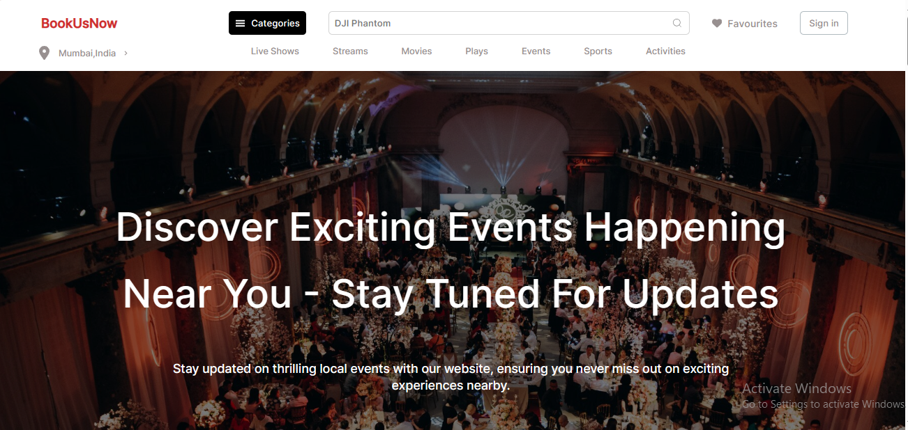

# BookUsNow
The project shows upcoming and recommended events happening near a person's location.You can see it here 

<p align="center"></p>


## Project Structure
The project is divided into 6 components:

1. Header component 
2. AboutUs component which displays a description of the website
3. RecommendedShows which contains all the shows recommended for user's location
4. ShowCard which contains the structure according to which the recommended shows will display.
5. UpcomingEvents which displays the events that will be happening in the future.
6. EventCard which contains the structure according to which the upcoming events will display.

## Features
1. Responsive (works for both desktop as well as mobile view)
2. Infinite horizontal scroll feature for the recommended shows. 
3. Lazy loading (infinite scrolling) concept is used and the remaining events are displayed only when we reach the end of the page hence better overall performance.

## Getting Started
### 1. Clone the repository
```
git clone https://github.com/b-kuhu/upcoming-events
```

### 2. Requirements
The project is created using ReactJS.Make sure you have NodeJS installed in your system. If you have it already, you can install the dependencies used in the project using:
```
npm install
```


### 3. Run
With all required dependencies installed and cloned repo, run `npm run dev` in the directory of the project. Then you have the project working.

